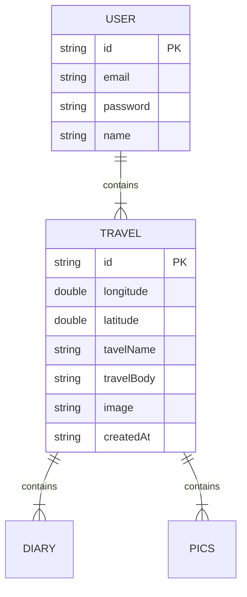

# Inter-Travel

- 요구사항
- 데이터 베이스 설계

## 요구사항

1. 유저들은 여러가지 여행 마커를 가진다.
3. 유저가 여행 했던 여행지 마다 일기를 볼 수 있으며 사진 또한 같이 볼 수 있다.
4. 유저는 작성했던 일기를 모아서 볼 수 있다.

## 데이터 베이스 설계

```mermaid
erDiagram
    USER ||--|{ TRAVEL : contains
    TRAVEL || -- |{ DIARY : contains
    TRAVEL || -- |{ PICS : contains


    USER {
      string id PK
      string email
      string password
      string name
    }


    TRAVEL {
      string id PK
      double longitude
      double latitude
      string tavelName
      string travelBody
      string image
      string createdAt
    }
```
