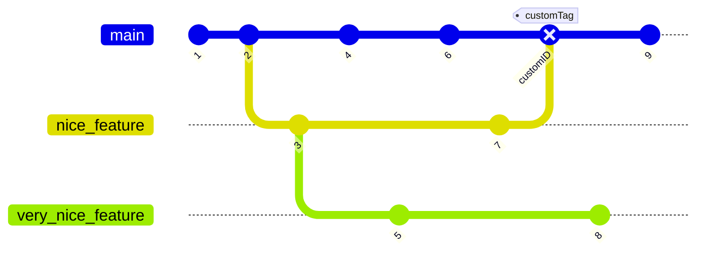

# Inter-Travel

- 요구사항
- 데이터 베이스 설계

## 요구사항

1. 유저들은 여러가지 여행 리스트를 가질 수 있다.
2. 여행 리스트 중 하나를 선택하면 내가 이전에 여행했던 곳들을 볼 수 있다.
3. 내가 여행 했던 여행지 마다 일기를 볼 수 있으며 사진 또한 같이 볼 수 있다.
4. 일기, 사진은 따로 따로 모아서 볼 수 있다.

## 데이터 베이스 설계

